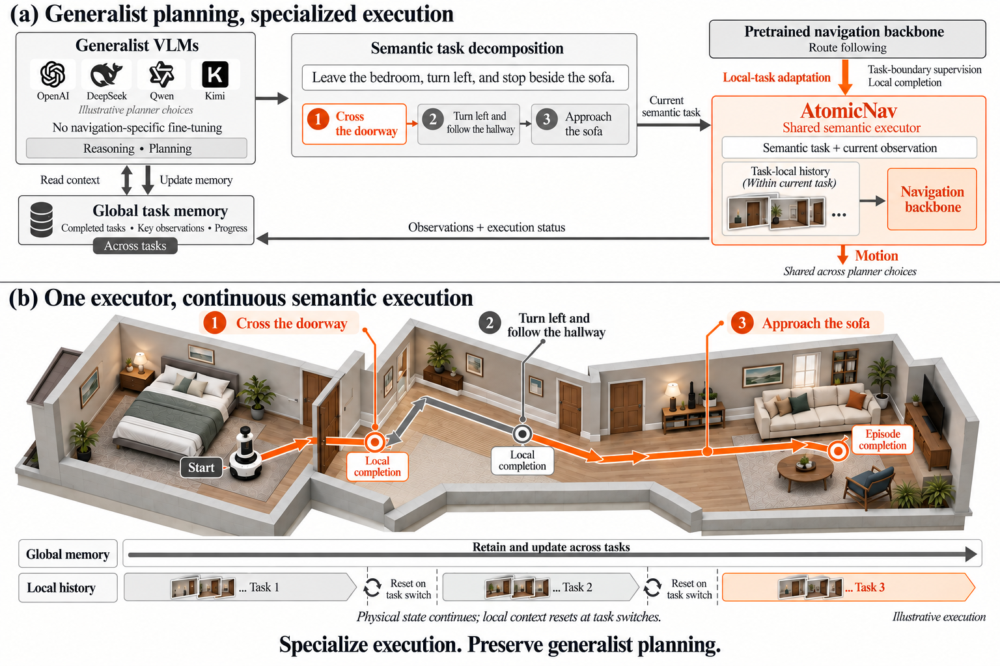

<div align="center">

# AtomicNav

### Generalist VLM planning with reusable atomic RGB navigation execution

A small planner–executor interface for vision-and-language navigation. A generalist VLM chooses the next semantic subgoal; an RGB navigation policy carries it out and returns a local completion signal.

<p>
  <a href="docs/method.md">Method</a> ·
  <a href="docs/reproduction.md">Reproduction notes</a> ·
  <a href="examples/semantic_handoff.py">Interface example</a> ·
  <a href="CITATION.cff">Citation</a>
</p>

</div>

<p align="center">
  
</p>

AtomicNav keeps route reasoning and continuous control in separate interfaces. The planner sees the route instruction, the current RGB observation, and causal task memory. It emits one short intention with an observable completion condition. The executor acts from the current physical state until it emits `STOP`; the next planner call resumes from the state that was actually reached.

## The interface

| Planner | Executor |
| --- | --- |
| Reads the full route and tracks progress across subgoals. | Runs the local RGB action loop and resolves visual ambiguity. |
| Emits a semantic subgoal, not a long trajectory. | Emits actions and a local `STOP`. |
| Owns global memory and decides what comes next. | Owns task-local history and completion evidence. |

An atomic subgoal is deliberately simple:

```text
instruction:  "Enter the bedroom and face the chair."
completion:   "Stop fully inside the bedroom, facing the chair."
scope:        "INTERMEDIATE"   # or FINAL
```

The physical state is continuous across subgoals. A local `STOP` returns control to the planner; only a `FINAL` subgoal ends the route.

## Quick start

This public snapshot is documentation-first and dependency-light. It does not bundle the simulator, model weights, benchmark assets, or service credentials.

```bash
git clone https://github.com/WatchBirder/AtomicNav.git
cd AtomicNav

# Run the dependency-free interface example
python examples/semantic_handoff.py
```

To connect your own models, implement the two small interfaces shown in [`examples/semantic_handoff.py`](examples/semantic_handoff.py):

```python
class Planner:
    def next_subgoal(self, route_instruction, observation, memory):
        ...  # call your general VLM and return AtomicSubgoal

class Executor:
    def run(self, subgoal, observation):
        ...  # call your RGB navigator and return Handoff
```

The full handoff loop is provided by `run_atomicnav_episode(...)`. The same protocol can wrap different general VLM planners or RGB executors without changing the route-level state machine.

## What is included

```text
assets/overview.png             paper-style overview figure
assets/architecture.svg         lightweight interface diagram
examples/semantic_handoff.py   dependency-free planner/executor API example
docs/                           method and reproduction notes
```

The repository intentionally excludes private datasets, simulator assets, checkpoints, raw traces, internal paths, benchmark tables, and credentials. It is meant to make the method and integration boundary understandable before a complete release package is prepared.

## Documentation

- [`docs/method.md`](docs/method.md) — problem setting, planner, executor, and handoff semantics.
- [`docs/reproduction.md`](docs/reproduction.md) — release boundary and requirements for a full run.
- [`docs/demo.md`](docs/demo.md) — public demo and redistribution notes.
- [`NOTICE.md`](NOTICE.md) — third-party and redistribution notices.

## Citation

Citation metadata is provided in [`CITATION.cff`](CITATION.cff). The paper title and author list remain provisional until the public release.

<div align="center">

[](https://github.com/WatchBirder/AtomicNav)
[](https://www.python.org/)

</div>


