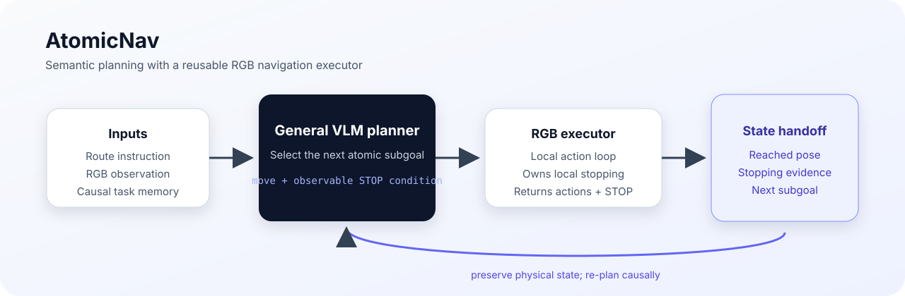

# AtomicNav*

**AtomicNav*: General VLM Planning with Atomic Subgoals for RGB Vision-and-Language Navigation**

AtomicNav separates route-level semantic planning from low-level navigation execution. A general vision-language model converts a route instruction and visual history into short, executable subgoals. A reusable RGB executor follows each subgoal, decides when its local condition is satisfied, and emits `STOP` before the planner advances to the next subgoal.

The design targets a practical interface between general-purpose multimodal reasoning and a navigation policy that already knows how to move in an RGB simulator.



## Method

```text
route instruction + current RGB observation + causal task memory
                                │
                                ▼
                    general VLM planner
                                │  atomic subgoal
                                ▼
                     RGB navigation executor
                                │  local actions + STOP
                                ▼
                  updated state → next subgoal
```

An atomic subgoal has two parts:

1. a concise movement intention (for example, *enter the bedroom* or *walk to the stair opening*);
2. an observable termination condition (for example, *stop fully inside the bedroom*).

The executor is not reset at subgoal boundaries. Its physical pose and causal history are handed to the planner, so the next subgoal is grounded in the state that was actually reached.

## Repository status

This repository is a curated research snapshot. It contains the public-facing method description, the development evaluation protocol, and aggregate exploratory results. Private datasets, simulator assets, checkpoints, inference credentials, raw traces, and internal absolute paths are intentionally excluded.

The current numbers are development-cohort results, not a claim of standard benchmark state of the art. See [`docs/reproduction.md`](docs/reproduction.md) for the exact scope and limitations.

## Repository layout

```text
.
├── assets/                    Architecture figure
├── configs/                   Versioned development configuration
├── docs/                      Method, reproduction, and demo notes
├── results/                   Curated aggregate tables only
├── scripts/                   Small result-reporting utilities
├── CITATION.cff
├── NOTICE.md
└── README.md
```

## Quick start

The repository is documentation-first at this stage. To inspect the included development table:

```bash
python scripts/summarize_results.py results/ablation_dev100.csv
```

The full simulator and model weights are maintained separately because they are large, licensed, and environment-specific. Internal reproduction requires the corresponding private asset bundle and a compatible RGB navigation executor; the public snapshot does not silently substitute paths or credentials.

## Development results

The table below reports a paired 100-episode development cohort. `SR`, `SPL`, and `OSR` are percentages; `NE` is navigation error in metres.

| Variant | SR | SPL | OSR | NE (m) |
|---|---:|---:|---:|---:|
| AtomicNav (full online memory) | 79.00 | 63.64 | 87.00 | 2.57 |
| RGB + text memory | 73.00 | 60.02 | 85.00 | 2.87 |
| RGB, no cross-subtask memory | 72.00 | 61.93 | 81.00 | 2.87 |
| Initial plan only | 57.00 | 49.38 | 75.00 | 3.63 |
| AtomicNav + DualVLN executor | 62.00 | 49.86 | 81.00 | 4.28 |
| AtomicNav + AwareVLN executor | 71.00 | 59.81 | 84.00 | 3.78 |
| AtomicNav + LightNav executor | 78.00 | 69.79 | 82.00 | 2.68 |
| GPT-6 Sol planner + v6 executor | 68.00 | 55.41 | 80.00 | 3.66 |
| GPT-6 Luna planner + v6 executor | 56.00 | 46.71 | 67.00 | 4.89 |
| Released DualVLN whole-route reference | 56.00 | 49.07 | 67.00 | 5.10 |
| Qwen3.8-max planner + v6 executor | 68.00 | 54.40 | 83.00 | 3.16 |
| Qwen3.6-35B-A3B planner + v6 executor | 47.00 | 37.70 | 54.00 | 5.58 |
| Free-form delegation + v6 executor | 71.00 | 61.98 | 80.00 | 3.11 |

For definitions, cohort construction, and caveats, see [`results/README.md`](results/README.md). The aggregate CSV is [`results/ablation_dev100.csv`](results/ablation_dev100.csv).

## Reproduction scope

The intended publication release will add the simulator adapter, model configuration, and licensed data instructions after the environment and redistribution terms are frozen. Until then, this repository should be treated as a method and provenance record rather than a one-command reproduction package.

## Citation

The citation metadata is provided in [`CITATION.cff`](CITATION.cff). The paper title and author list are provisional.
